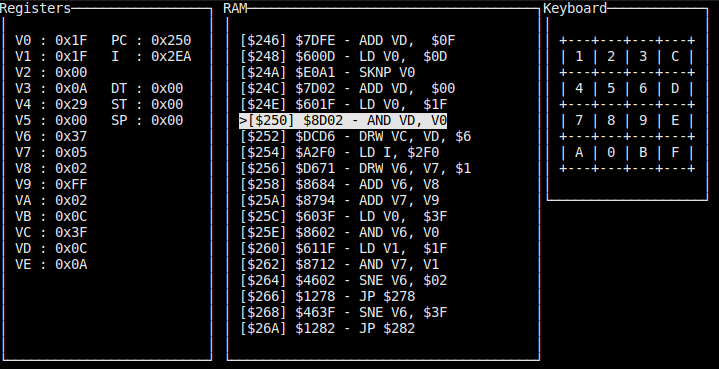

# Chip8 Interpreter, Assembler & Disassembler
This is a personal project. Made it to learn about interpreters & CPUs.  
It only tested on Ubuntu, but it will most likely run on any Debian-based ditribution.  


## Dependencies
You'll need `SDL2` and `ncurses` to run this program. You can install it with :  
```sh
sudo apt-get install libsdl2-dev
sudo apt-get install libncurses5-dev libncursesw5-dev
```
This program was only tested with these libraries version so it runs with any other please let me know!  
You'll also need to create the folder `./obj` that will be used during compilation.  
Once you're all set, you can just run `make` in the root directory.


## How to use it


Once you've installed dependencies, you can run `make` it'll generate `c8interpreter`.  

At least, you have to provide a filename to run it.  

There are several different options :

 Flag | Descripton |
| --- | --- |
| `-d <filename>` | It will disassemble the file you're giving it. It'll be stored in `disass.asm`
|`-c` | Allows you to set the number of instruction per second. Default is `100`.
|`--font <base_10_addr>` | Allows you to specify fonts start address. Default is `0x50`.
|`--no-monitor` | Disable monitoring with `ncurses`.
|`--tests` | Run tests. It won't do anything else even if a file is provided. Currently there are no tests, still need do it.    

## Keys
Keys are mapped the same way. It was tested on an `azerty` keyboard.  
You can press `space` from the monitoring terminal or the SDL2 window to `halt` execution.
 
# Monitoring interpreter
You can see the state of registers, RAM around current `program counter` and keyboard state at any time if you havn't set `--no-monitor` option. 

If you press any key, it'll be highlighted.


  

# Assembler

If you want to take a look at the assembler, go [here](./assembler), there are some examples.

# Screenshots


## TODO

- Fix some opcodes interpreter
- Improve disass with labels ?
- Some examples with jumps etc
- Supervisor with `ncurses` to dump RAM, VRAM-like & registers ?

## References

Here are listed all of the websites/emulators I used during development.  
1. http://devernay.free.fr/hacks/chip8/C8TECH10.HTM - For everything available on it.
2. https://code.austinmorlan.com/austin/chip8-emulator - Mainly for graphics & used it to check my opcodes implementations.
3. https://github.com/mwales/chip8 - Took some ROMs from this repo.
4. http://www.multigesture.net/articles/how-to-write-an-emulator-chip-8-interpreter/ - Took font array from here.
5. https://www.zophar.net/pdroms/chip8/chip-8-games-pack.html - Most of the ROMs were taken here.
