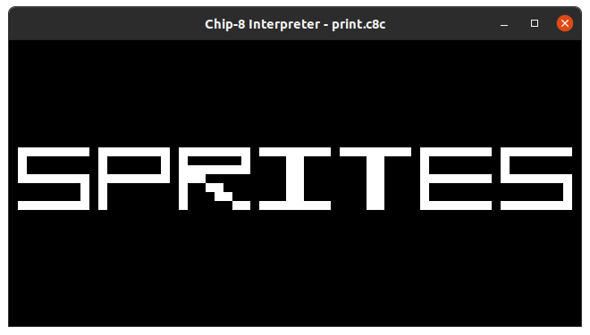
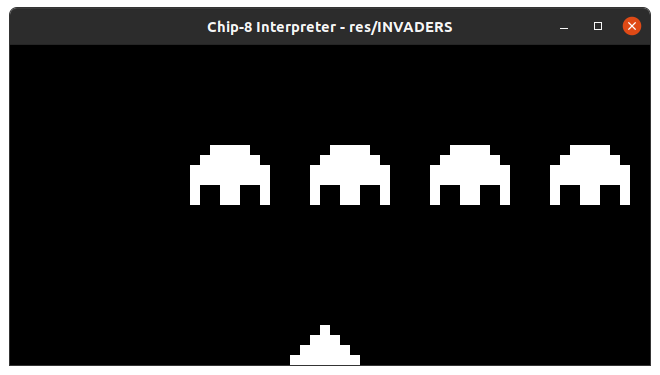

# Chip8 Interpreter, Assembler & Disassembler
This is a personal project. Made it to learn about interpreters & CPUs.  
It only tested on Ubuntu, but it will most likely run on any Debian-based ditribution.

## Dependencies
You'll need `SDL2` to run this program. You can install it with :  
`sudo apt-get install libsdl2-dev`  
You'll also need to create the folder `./obj` that will be used during compilation.  
Once you're all set, you can just run `make` in the root directory.

## How to use it
___
First you'll need to compile it. You'll need `make` and `SDL2`.  
  
Currently, you can :  
- Run a chip8 program, they're located in `./res`. You can also provide your own if you want to. To run a program use : `./chip8Interpreter [path_to_file]`  
- You can specify the number of instructions per second with the `-c` flag. Default is `100` that what looks good on my computer but feel free to test it on yours.
- Specify the `font` starting location, as I saw that some people assume that it's located at `0x000` and others at `0x050(80)`, you can specify with the `--font [base10 addr]` flag. Currently it doen't support hex address. Will probably be added sometime.
- You can also disassemble a file with :  
`./chip8Interpreter -d [path_to_file]`   
Disassambler won't generate code that you can re-assemble as it can't retrieve sprites data. Will probably modify assembler to add a singature to assembled files so disassembler can export spires too.
Result will be stored in `disass.asm`. File created can't be compiled, I just use it to understand roms.

# Assembler

If you want to take a look at the assembler, go [here](./assembler), there are some examples.

# Screenshots

## TODO
---
- Fix some opcodes interpreter
- Improve disass with labels ?
- Some examples with jumps etc
- Supervisor with `ncurses` to dump RAM, VRAM-like & registers ?

## References
---
Here are listed all of the websites/emulators I used during development.  
1. http://devernay.free.fr/hacks/chip8/C8TECH10.HTM - For everything available on it.
2. https://code.austinmorlan.com/austin/chip8-emulator - Mainly for graphics & used it to check my opcodes implementations.
3. https://github.com/mwales/chip8 - Took some ROMs from this repo.
4. http://www.multigesture.net/articles/how-to-write-an-emulator-chip-8-interpreter/ - Took font array from here.
5. https://www.zophar.net/pdroms/chip8/chip-8-games-pack.html - Most of the ROMs were taken here.
